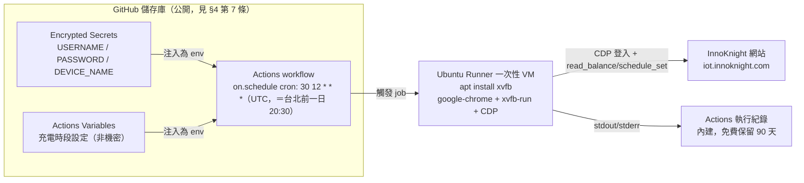
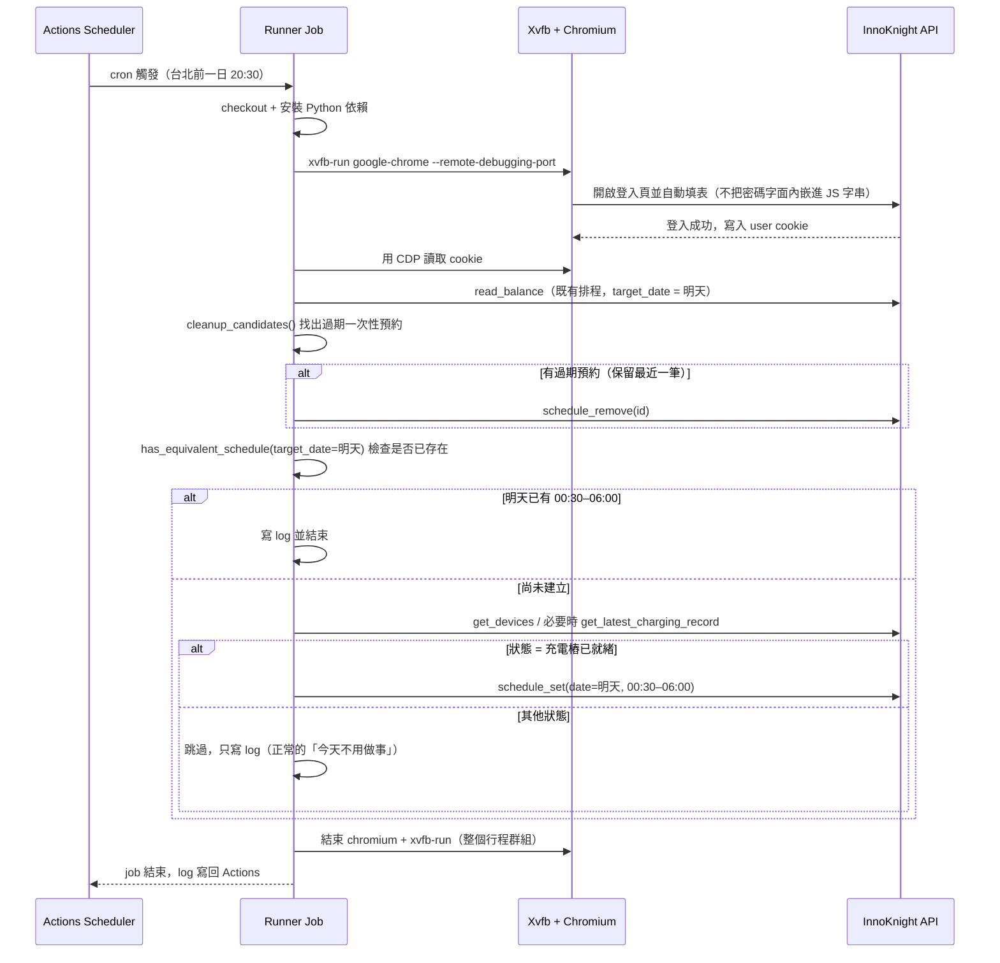
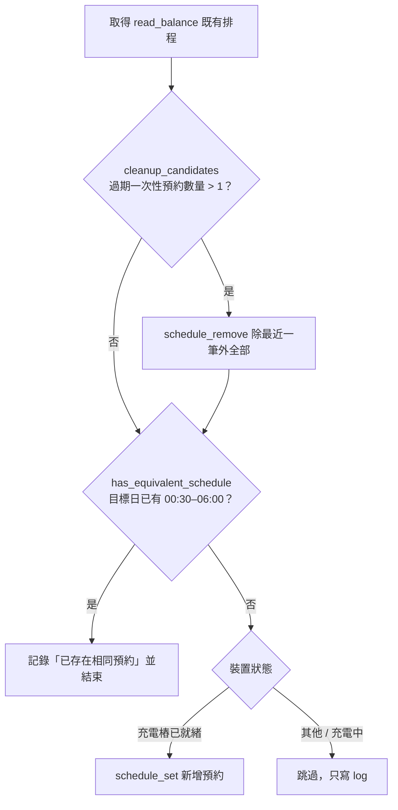

# 設計文件：場景一 Use Case 1 — 個人每日自動充電預約（GitHub Actions 雲端化）

> 本文件是 [innoknight-charging-scheduler](https://github.com/swchen44/innoknight-charging-scheduler) 研究文件
> [`docs/research/cloud-architecture.md`](https://github.com/swchen44/innoknight-charging-scheduler/blob/main/docs/research/cloud-architecture.md)
> 中「情境一：個人使用」的落地設計。研究文件已經過兩輪獨立架構評審，本設計直接採用評審修正後的結論，不再重新論證。
> 實作步驟見 [plan.md](plan.md)，驗證與除錯全紀錄見 [PDCA.md](PDCA.md)。

> **目前運行狀態（2026-09-03）**：go/no-go 已 **GO**、每晚自動排程（Phase 4）已上線，
> **原自管主機已停用，雲端版是唯一運作中的系統**。辨識期（雲端版暫用 07:00–10:00
> 供人工核對）已結束，Variables 已改回真正的離峰 **00:30–06:00**；觸發時間也已從
> 22:05 調整為 **20:30**（緩衝拉到 4 小時，見 §4 第 1 條與 [PDCA.md](PDCA.md)）。
> **沒有後備系統**是目前最大的營運風險——新的 20:30 觸發＋離峰時段組合尚未經過
> 真正的自動排程驗證（此前只驗證過手動 dispatch），近期需要更頻繁的人工巡查，
> 見 §8「監控」。

## 1. 目標與範圍

### Use Case 1：每日自動離峰充電預約

**現況**：`innoknight-charging-scheduler` 在一台自己管理的雲端主機上，用系統 `crontab` 觸發
`scripts/innoknight-cron.sh`，以 Xvfb + Chromium 登入 InnoKnight 網站（iot.innoknight.com），
設定當天 00:30–06:00 的離峰充電預約。

**目標**：功能完全一致，但**完全不用自己顧主機**——改由 GitHub Actions 代管的 runner 觸發與執行，
每月成本 NT$ 0。

具體行為：

- 每天**台北時間前一晚 20:30**（UTC cron `30 12 * * *`）觸發，與窗口開始時間保留 4 小時緩衝。
- 清理過期的一次性舊預約（只保留最近一筆）。
- 若**明天**（`target_date` = 隔天）已有 00:30–06:00 預約就結束；否則視裝置狀態決定是否新增。
- 預設 dry-run，需要明確旗標（`--apply`）才會動遠端資料。

### 範圍外（本專案第一版不做）

- **模板化分享給朋友**（Use this template）：屬於情境一的第二階段，必須先通過本文件
  §6 的 go/no-go 驗證（IP 風控）後才啟動，見 [plan.md](plan.md) Phase 5。
- **多租戶／PWA**（情境二）：另一個獨立專案，本專案是它上線前的風險驗證前哨。
- **跨午夜充電窗**（如 23:00–02:00）：沿用純函式的既有限制，充電窗必須落在同一天。

## 2. 與現有專案的關係

| 項目 | 作法 |
|---|---|
| 核心 Python 邏輯（`automation.py` / `client.py` / `scheduler.py` / `browser_session.py`） | **原封沿用，不重寫**。只調整啟動方式與帳密來源 |
| `crypto.py` | **必須保留**。它是 InnoKnight 通訊協定的實作（`LOGIN_IV` / `SCHEDULE_KEY` / 每日輪替 `login_key()`），跟帳密保管完全是兩回事，不加密伺服器不收 |
| `.env` 檔 | **移除**。帳密改用 GitHub Actions Secrets，設定值改用 Actions Variables |
| `scripts/innoknight-cron.sh`（crontab 進入點） | **由 workflow YAML 取代** |
| 執行引擎（Xvfb + Chromium + CDP） | 沿用。不搬 Cloudflare Browser Rendering——不是配額不夠（10 分鐘/天對一天一次綽綽有餘），而是 `subprocess.Popen(["xvfb-run", ...])` 自管子行程的模式在 Workers V8 isolate 完全不支援，重寫成本對已能動的個人工具沒有正當理由 |

## 3. 架構

### 每次執行流程

### 判斷邏輯（沿用 `scheduler.py` 純函式）

## 4. 關鍵設計決策

每一條都對應研究文件評審後的結論：

1. **觸發時間前移到前一晚，`target_date` 永遠是明天，緩衝拉到 4 小時**。GitHub 排程
   觸發器在尖峰 UTC 時段有延遲案例；原「00:05 觸發、00:30 開始」只有 25 分鐘餘裕——這正是
   原專案本機 cron 時區錯亂時真實發生過的 bug，只是成因換人。改成前一晚觸發、目標日設隔天，
   結構性避開了「開始時間已過」的問題。**觸發時間本身經過兩次調整**：文件研究階段參考
   GitHub Community #191400 引用的「15 分鐘至 2 小時」案例，選了 22:05（2h25m 緩衝）；
   但 2026-08-30 起實際上線量測，真實延遲落在 **3.5–5.8 小時**，明顯超過原引用案例，
   2026-09-03 改為 **20:30 觸發**（UTC `30 12 * * *`），把緩衝拉高到 **4 小時**。
   即使延遲把實際執行時間推過午夜，也不會建立錯日期的預約——`target_date` 是每次執行當下
   重新用 Taipei 實際時間算出的「明天」，不是靜態算好綁在 cron 上的值（自我修正機制，
   細節與延遲實測數據見 [PDCA.md](PDCA.md)）。移動觸發時間到更早也有代價：越早，車輛
   在觸發當下還沒回家插上充電的機率越高，可能造成 `device_not_ready` 誤判跳過——20:30
   是「緩衝要求」與「車輛通常已到家」之間權衡後的選擇，不是越早越好。
2. **UTC cron 是唯一事實來源**。台北是 UTC+8、全年無日光節約時間，UTC cron 恆等於固定的
   台北時間，這是恆定的數學事實。`on.schedule.timezone` 欄位（GitHub 2026/3 新功能）
   只能當提高可讀性的輔助，且要實測過才加，不預設依賴。
3. **瀏覽器用 `browser-actions/setup-chrome`（Chrome for Testing）**。
   Ubuntu 的 `chromium-browser` apt 套件是 snap wrapper，runner 沒有可用的 snapd，根本裝不起來。
   `INNOKNIGHT_CHROME_PATH` 由 workflow 帶入 setup-chrome 的輸出路徑。
4. **用 headful（headless: false）+ Xvfb + `--disable-gpu`**（2026-08-29 實測定案，
   完整證據見 [PDCA.md](PDCA.md)）。沿用原專案「headful 降低被判定機器人機率」的用意；
   headful 在 GH Actions 無頭環境需要 Xvfb 提供虛擬顯示，且**必須**加 `--disable-gpu`
   （runner 無 GPU，headful Chrome 少了它會卡在 GPU 初始化直到 CDP 逾時——這一點曾讓
   中途誤判成「Chrome 移除了 headful CDP」，經四變體對照實驗推翻）。是否能因此通過
   InnoKnight 的 reCAPTCHA，正是 §6 go/no-go 要驗證的問題。
5. **密碼絕不以字串內嵌進要執行的 JS**。現有 `build_login_script()` 用 `json.dumps()` 把密碼包進
   JS 表達式；GitHub secret masking 是字面比對，JSON/Unicode 跳脫後不再等於 secret 原文，
   masking 會失效，且 CDP 錯誤訊息可能把整段表達式（含密碼）印進 log。
   改用 CDP `Runtime.callFunctionOn` 以 `arguments` 傳值，或 `Input.insertText` 逐欄輸入，
   並在錯誤處理路徑裁掉可能含表達式內容的欄位。這裡先修好，未來情境二直接沿用。
6. **Secrets 與 Variables 分清楚，但界線以「公開後會不會洩漏個資」畫**：
   帳號、密碼是機密（Secrets）；**裝置名稱也放 Secrets**——公開 repo 的 Actions log
   全世界可讀，而裝置名稱是建案名稱＋車位號碼（住處線索），放 Secrets 才會被自動遮罩。
   充電時段（`INNOKNIGHT_START_TIME` / `INNOKNIGHT_END_TIME`）不是個資，放 Variables。
7. **repo 設公開**（使用者決定，2026-08-29）。研究文件原建議私有，改公開的代價與收穫：
   - **收穫**：公開 repo 的 Actions 分鐘數免費不限量（不再受 2,000 分鐘/月限制）；
     免費取得 push protection（自動擋下不小心 commit 的密鑰）。
   - **代價 1——60 天無活動自動停用排程**：公開 repo 的 `schedule` workflow 在 60 天
     沒有 push/PR 活動後會被自動停用，且排程執行本身不算活動，這是無聲失效。
     **對策已實作並驗證有效**：`keepalive.yml` 每月 1、15 號自動 push 一個時間戳 commit
     重置計時（任何 commit 都會重置所有 scheduled workflow 的計時），根治此問題，
     不需人工介入。GitHub 停用前的警告信作為 keepalive 若故障時的最後防線。
   - **代價 2——Actions log 全世界可讀**：因此「密碼不內嵌 JS」（第 5 條）在**第一次
     真實執行之前**就必須完成（已完成，不是之後才補），且裝置名稱放 Secrets（第 6 條）、
     log 不印 cookie/token 內容。
   - **代價 3——`crypto.py` 協定常數公開**：其中的常數是從 InnoKnight 前端 JS 逆向的
     協定實作，公開 repo 等於公開這件事（ToS 層面考量，不影響帳密安全），使用者已知情接受。
8. **供應鏈防護**：所有第三方 Action（`actions/checkout`、`actions/setup-python`、
   `browser-actions/setup-chrome`）釘死在完整 commit SHA，不用 `@v4` 這種可變 tag；
   workflow `permissions:` 設到最小（`contents: read`）。
9. **exit code 策略**：`device_not_ready`（充電中等）是正常的「今天不用做事」，回 0；
   但 `device_not_found` / `device_missing_schedule_target`（設定錯誤，永遠不會自己好）回**非 0**，
   讓 GitHub 內建的「workflow 失敗寄信」變成免架設的告警管道。
10. **殘留行程問題結構性消失**：GitHub Actions 每次都是全新一次性 VM，跑完即銷毀，
    原專案 commit `64f6410` 修過的 Xvfb 洩漏這類長駐主機問題不會存在。

## 5. 帳密與安全

- 帳密（與裝置名稱）只存在本 repo 的 GitHub Secrets：libsodium 加密後才離開瀏覽器、
  靜態儲存 AES-256、只在 workflow 執行當下解密注入環境變數。
- 只透過 GitHub 網頁 Settings 或 `gh secret set` 設定，**絕不 commit 填好帳密的 `.env`**。
- GitHub 帳號**開啟 2FA**。
- **repo 是公開的，Actions log 全世界可讀**——所以：憑證絕不以字面出現在任何 JS 字串或
  錯誤訊息（實作與對應測試見 [developer.md](developer.md)「安全規則」）；裝置名稱放
  Secrets 讓它被自動遮罩；log 不印 cookie/token 內容。
- 生命週期：刪 repo 不會讓 InnoKnight 密碼失效，真正的「退出」是去 InnoKnight 改密碼。

## 6. 風險與待驗證清單

此清單同時是未來情境二（多租戶版）的可行性守門員。**驗證結果全程記錄於 [PDCA.md](PDCA.md)。**

- [x] **【go/no-go】GitHub Actions 共用 IP 是否被 InnoKnight 風控／reCAPTCHA 擋下** →
  **GO**。關鍵是用 **headful**（真實指紋）：headless 被 reCAPTCHA 直接拒（`success:false`），
  headful 則間歇性放行；程式在被拒時重載頁面重試最多 3 次。2026-08-30 dry-run 端到端跑通。
- [x] 確認 Chrome 執行檔路徑並固定 → 由 workflow 的 `browser-actions/setup-chrome` 輸出帶入。
- [x] 量測單次 job 總耗時 → **約 52 秒**（含一次重試；核心步驟 21 秒）。
- [x] 驗證憑證不內嵌 JS 的改法不影響登入成功率 → 已用 `Input.insertText` 路徑實測登入成功。
- [ ] **穩定性量測（新的头号待辦）**：連續多天 dry-run，統計平均重試次數與「3 次全被拒」的機率，
  決定 `max_login_attempts` 是否要調整、以及這個免費方案的實際可靠度。
- [~] 排程觸發器延遲：首夜（2026-08-30）實測延遲近 4 小時（UTC 14:05 設定 → 17:58 觸發），
  被「前一晚觸發」吸收，仍遠早於窗口，設計奏效。續跑數天觀察延遲分佈（見 [PDCA.md](PDCA.md)）。
- [~] 登入可靠度：首夜遇 reCAPTCHA 連續 3 拒失敗，已把重試上限調高至 5 並加遞增等待；續觀察殘餘失敗率。

## 7. 免費層數字

| 資源 | 免費額度 | 本用量 |
|---|---|---|
| GitHub Actions（公開 repo） | 免費、不限分鐘數 | 每天 1 次、預估 1–2 分鐘；另有 push/PR 觸發的 CI |
| GitHub Secrets | 免費、無上限 | 3 個（帳號、密碼、裝置名稱） |
| Actions 執行紀錄保留 | 90 天 | 足夠人工回查 log |

注意：公開 repo 換到不限分鐘數，但帶進「60 天無 push 活動自動停用排程」的無聲失效
風險，已用 `keepalive.yml` 根治（對策見 §4 第 7 條）。

## 8. 監控

exit code 不完全反映結果（「Actions 綠燈」≠「真的排到程」）：

- 設定錯誤類（`device_not_found`）以非 0 觸發 GitHub 失敗通知信（見 §4 第 9 條）。
- 正常跳過類（充電中）仍是綠燈，建議每隔一段時間人工看一次 log 內容，不要只看 job status。
- **自管主機已停用後（2026-09-03 起）沒有後備**：任一晚失敗都不會有其他系統補上。
  紅燈通知信收到當天要處理，用 workflow_dispatch 的 `target_offset_days`/`start_time`/
  `end_time` 手動補建（見 README「手動指定日期或時段」）。累積足夠穩定性數據
  （見 [PDCA.md](PDCA.md)）前，建議每天早上人工巡查一次，不要只依賴失敗通知信
  （reCAPTCHA 5 次重試全被拒是已知會發生的情境，不是假設）。
